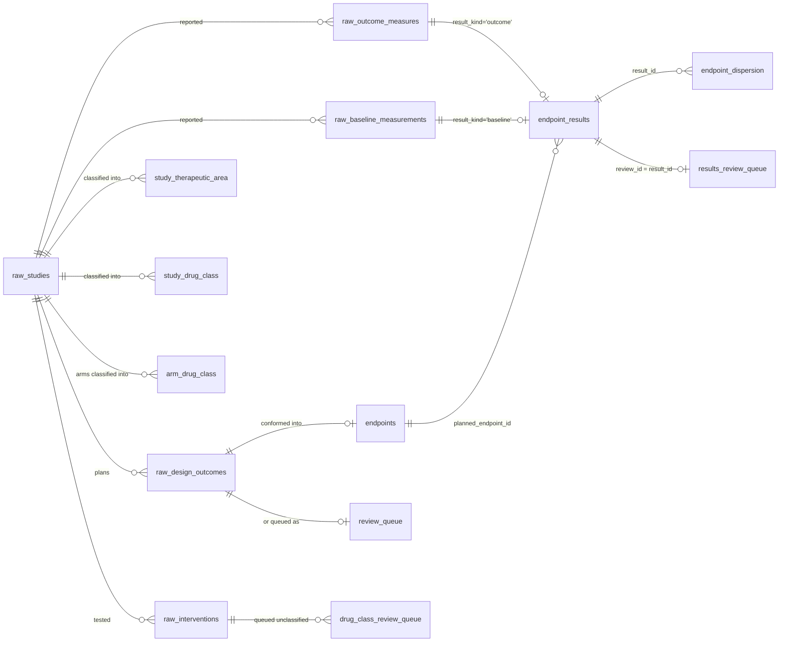
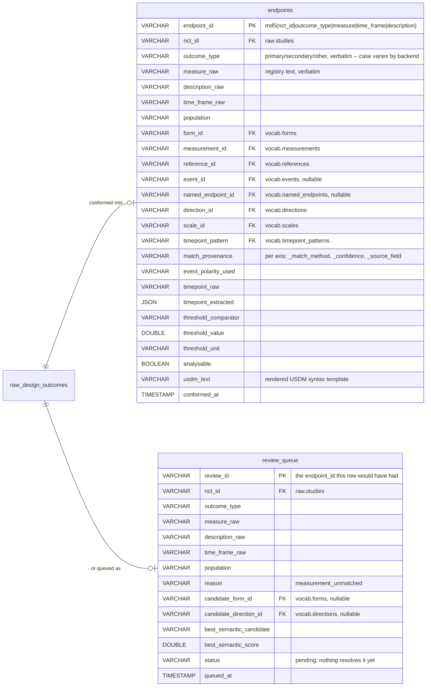
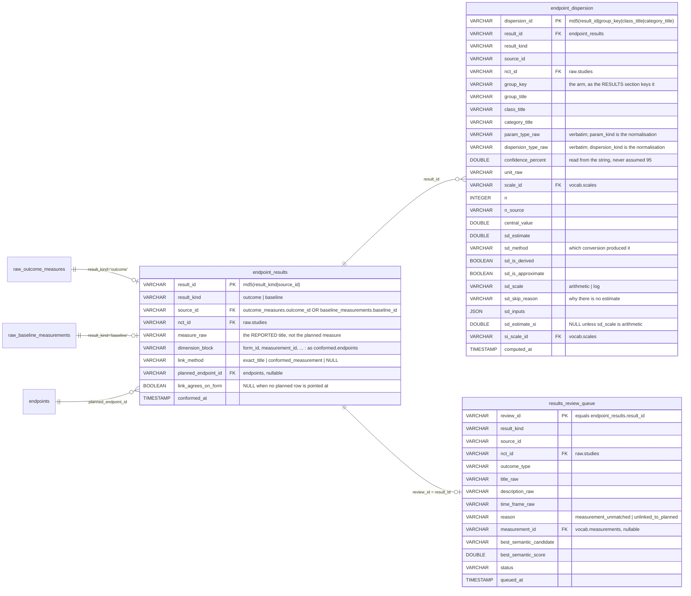
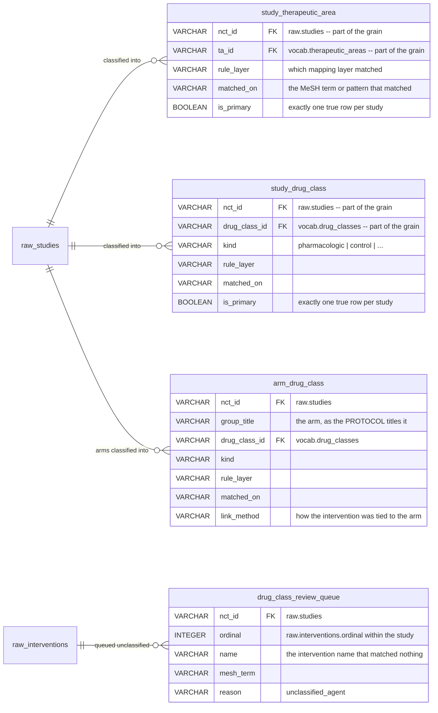
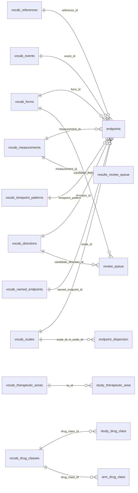
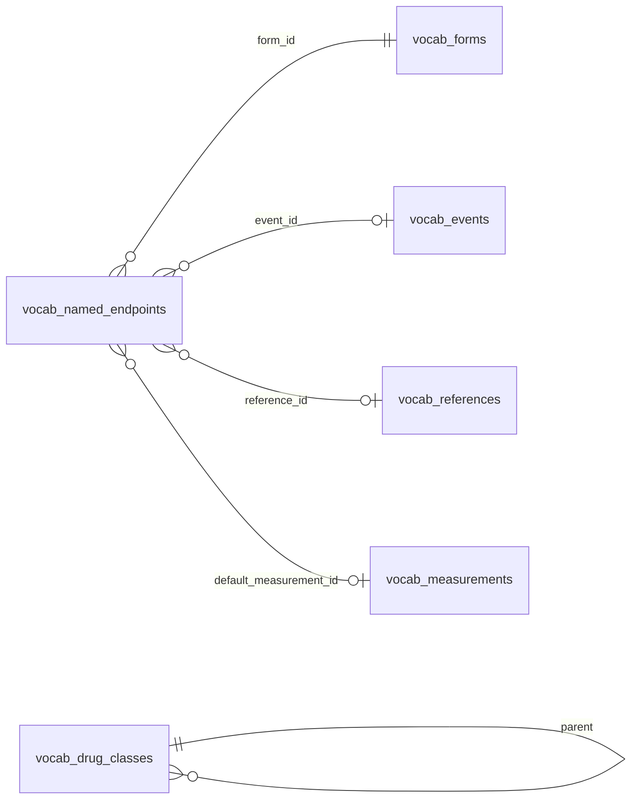

# Entity-relationship diagram: the `conformed` layer

> **Status: reference.** Drawn from the DDL in `conform/pipeline.py`,
> `results/pipeline.py`, `ta/resolver.py` and `drug_class/resolver.py` — those
> modules are the source of truth, this document is a picture of them. Where a
> column here disagrees with a `CREATE OR REPLACE TABLE` there, the DDL wins and
> this file is stale. The attribute blocks below carry each table's keys, its
> grain columns and every column that participates in a relationship; the full
> column lists stay in the DDL rather than being copied here, so there is one
> place to change when a column moves.

Read alongside:

* [`USAGE.md`](USAGE.md), "The warehouse" — the three schemas, and which command writes each
* [`QUERY_CHEATSHEET.md`](QUERY_CHEATSHEET.md) — the SQL that walks these edges
* [`ENDPOINT_RESULTS_SPEC.md`](ENDPOINT_RESULTS_SPEC.md) — why the planned and reported halves share a column block
* [`DRUG_CLASS_SPEC.md`](DRUG_CLASS_SPEC.md) — why class is resolved at both study and arm grain

---

## Read this before the diagrams

**There is not one foreign key in this warehouse.** DuckDB is given
`PRIMARY KEY` on five of the nine tables and nothing else. Every edge drawn
below is a *convention the pipeline maintains*, not a constraint the database
enforces — so a dangling reference is possible in principle, and one case
(see [Five edges that are not what they look like](#five-edges-that-are-not-what-they-look-like))
is deliberate.

**Every `conformed.*` table is replaced wholesale, never appended to.** Each
writer opens with `CREATE OR REPLACE TABLE`. These tables are derived from
`raw.*` and `vocab.*` and hold no state worth preserving independently of their
sources — which is also why the review queues carry a `status` column that no
command can currently write back (`endpoints review resolve` is declared and
unimplemented; see [`README.md`](README.md)).

**Ids are content hashes, not surrogates.** `endpoint_id`, `review_id`,
`result_id` and `dispersion_id` are each `md5` over the row's own identifying
text, so re-running a command over unchanged input reproduces the same ids.
Two consequences no diagram can draw: byte-identical source rows *collapse onto
one id* rather than duplicating, and ids are comparable across two warehouses
built from the same registry snapshot.

---

## The layer at a glance

Nine tables, written by three commands. Boundary entities from `raw.*` are drawn
without attributes — they are where the layer's rows come from, not part of it.

## The planned side

One `raw.design_outcomes` row conforms into `endpoints` **or** is queued in
`review_queue` — never both, never neither. The two tables share an id space:
a queued row's `review_id` is the `endpoint_id` it would have had.

`event_id` is nullable by design, and its NULL carries meaning. Only
event-family forms (`vocab.forms.event_family`) get an event at all, so a
change-from-baseline endpoint has `event_id IS NULL` because it *has no event*,
not because one went unresolved. That is the opposite of the axes whose
matching cascade ends in a `not_stated` fallback term (`vocab/matching.yaml`) —
there, a miss is a value you can group by, not a NULL.

## The reported side

`endpoint_results` carries the same dimension columns as `endpoints`, under the
same names — `tests/test_results_conform.py` asserts it — so a query written
against the planned half runs unchanged against the reported half.

## The study axes

Both axes are resolved by `pull` itself, from what that one pull already
fetched — there is no second network wave for either, and no separate resolve
command: `endpoints ta` and `endpoints drug-class` only *report* on what `pull`
wrote. None of these four tables declares a key.

## Grain and key, table by table

| table | grain — one row per | key | written by |
|---|---|---|---|
| `endpoints` | planned outcome that conformed | `endpoint_id` (PK) | `conform` |
| `review_queue` | planned outcome that did **not** conform | `review_id` (PK) | `conform` |
| `endpoint_results` | reported outcome, or baseline characteristic | `result_id` (PK) | `results conform` |
| `results_review_queue` | reported outcome needing review | `review_id` (PK) | `results conform` |
| `endpoint_dispersion` | arm × class × category measurement | `dispersion_id` (PK) | `results conform` |
| `study_therapeutic_area` | (study, therapeutic area) | `(nct_id, ta_id)`, undeclared | `pull` |
| `study_drug_class` | (study, drug class) | `(nct_id, drug_class_id)`, undeclared | `pull` |
| `arm_drug_class` | (study, arm, drug class) per contributing intervention | none — see below | `pull` |
| `drug_class_review_queue` | intervention that matched no class | `(nct_id, ordinal)`, undeclared | `pull` |

`arm_drug_class` is the one table without a key even by convention. An arm
holding two interventions that resolve to the *same* class contributes two
rows, differing only in `rule_layer`/`matched_on`. Count arms with
`count(DISTINCT (nct_id, group_title))`, never `count(*)`.

Note also that `endpoint_results` is at the *characteristic* grain for
baselines, not the arm grain: one FEV1 baseline characteristic conforms once
however many arms reported it, and the per-arm detail is `endpoint_dispersion`.

## The vocabulary joins

Every vocabulary dimension keys on `id`, and every `*_id` column below points at
it. Because the two fact tables share their dimension block, **each edge drawn
into `endpoints` exists identically into `endpoint_results`** — drawn once here
rather than sixteen times.

## Inside the vocabulary

Two structures in `vocab.*` are worth drawing, because a query that walks the
conformed layer will eventually walk them too.

`vocab.named_endpoints` is the only vocabulary table that reaches several
dimensions at once: recognising "PFS" can settle measurement, reference, form
and event together, rather than donating the name to one dimension as a
synonym. It is a *fallback*, not an override — each of those dimensions runs
its own ordinary cascade first, and the named-endpoint value fills only where
that cascade came back silent (the reference also requires a randomised
allocation). So `named_endpoint_id` and the dimension ids beside it are not a
parent and its expansion: they agree on rows the cascade could not resolve
alone, and the `*_match_method` column reading `named_endpoint` is what says
which axis was filled that way.

`vocab.drug_classes.parent` is the only self-reference anywhere in the
warehouse — one shallow level of rollup, validated at load time as acyclic and
as never changing `kind` halfway up (a mechanism term must not roll up into a
modality one). The resolver does **not** walk it: primary class is chosen by
the flat `precedence` column, tie-broken by how many interventions back each
class. So `parent` is available to a query that wants to roll up, and is not
already applied to what the conformed tables hold.

## Five edges that are not what they look like

**`endpoint_results.link_method` can be non-NULL while `planned_endpoint_id`
is NULL.** That is intentional, not a dangling reference. It means the reported
title matched a planned outcome verbatim, but that planned outcome went to
`review_queue` rather than `endpoints` — the link is real, the target is not
there to point at. A query counting linked results has to test the column it
actually means.

**`results_review_queue` overlaps `endpoint_results`; it does not partition
it.** The planned side is a clean split — a `raw.design_outcomes` row lands in
`endpoints` or in `review_queue`, never both. The reported side is not. A row
queued `measurement_unmatched` never reached `endpoint_results`; a row queued
`unlinked_to_planned` is *also* in `endpoint_results`, fully conformed, with
`link_method` NULL. `WHERE reason = ...` is what separates them.

**`endpoint_dispersion.group_key` and `arm_drug_class.group_title` are not the
same arm.** `group_key` is the results section's own arm id; `group_title` is
the protocol's arm title. How often the two agree has not been measured, which
is why `endpoints stats` does not group dispersion by drug class (see
`write_arm_drug_class`'s docstring, and [`DRUG_CLASS_SPEC.md`](DRUG_CLASS_SPEC.md),
"Class is an arm property"). Joining them yields a number resting on an
unmeasured join.

**`outcome_type` is not case-normalised anywhere.** It is stored as the backend
wrote it, on `endpoints`, `review_queue`, `endpoint_results` and
`results_review_queue` alike — the CT.gov API path writes `primary`, AACT
writes `Primary`. `WHERE outcome_type = 'PRIMARY'` silently returns nothing on
either. Compare case-insensitively. (`raw.outcome_measures`'s `outcome_id` hash
*does* case-fold it, so re-pulling a study through the other backend does not
renumber its results rows — but the stored column is still verbatim.)

**`endpoint_results.measure_raw` holds the reported title, not the planned
`measure`.** The name is shared with `conformed.endpoints` deliberately: a query
that has to be rewritten to move between the planned and reported halves is a
query that will silently be wrong on one of them.

## Reaching back into `raw`

The layer keeps enough of a handle to get back to its source rows, which is how
the arithmetic behind a number gets audited:

| from | to | on |
|---|---|---|
| `endpoint_results` (`result_kind='outcome'`) | `raw.outcome_measures` | `source_id = outcome_id` |
| `endpoint_results` (`result_kind='outcome'`) | `raw.outcome_analyses` | `source_id = outcome_id` |
| `endpoint_results` (`result_kind='baseline'`) | `raw.baseline_measurements` | `source_id = baseline_id` |
| `endpoint_dispersion` | `raw.outcome_measurements` | `(source_id, group_key, class_title, category_title)` |
| `endpoint_dispersion` | `raw.outcome_groups` | `(source_id, group_key)` |
| `arm_drug_class` | `raw.arm_interventions` | `(nct_id, group_title)` |
| `drug_class_review_queue` | `raw.interventions` | `(nct_id, ordinal)` |
| any table | `raw.studies` | `nct_id` |

`source_id` is polymorphic: it means something only together with `result_kind`,
because an `outcome_id` and a `baseline_id` are drawn from different id spaces.
Every join above that uses it must carry the `result_kind` predicate too.
